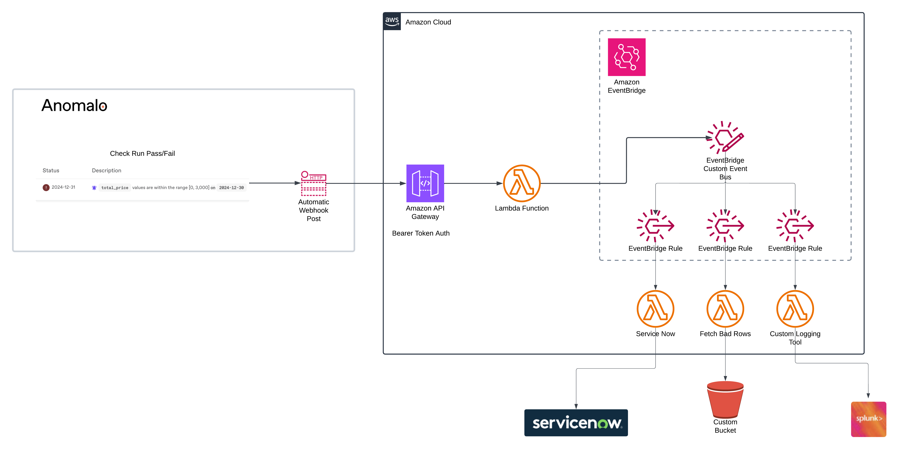

# Anomalo EventBridge Integration

Anomalo can be configured to send all check run results a webhook destination. This terraform module sets up the required resources to consume that webhook and send the results to an AWS EventBridge event bus.  From there, you can route the events to other AWS services or third-party services along with any additional processing you may want to do.

## Architecture



## Usage

```hcl
module "anomalo_eventbridge" {
  source              = "git::https://github.com/joewimmer/terraform-aws-anomalo-eventbridge.git"
}
```


## Integrating With EventBridge

With this in place and your Anomalo account configured to send webhook events to the URL provided by this module, you can now set up an EventBridge rule to process those events.

```hcl
resource "aws_cloudwatch_event_rule" "anomalo_events" {
  name        = "anomalo-events"
  description = "Anomalo events from the webhook"
  event_pattern = jsonencode({
    source = ["com.anomalo.events"]
    })
    event_bus_name = module.anomalo_eventbridge.event_bus_name
}
```


## Filtering on Event Types

One of the most useful features of EventBridge is the ability to filter events based on their type. Anomalo sends different types of events, such as `check_run`, `check_run_completed`, and `check_run_failed`. You can filter these events in your EventBridge rule.

```hcl
resource "aws_cloudwatch_event_rule" "anomalo_events" {
  name        = "anomalo-events"
  description = "Anomalo events from the webhook"
  event_pattern = jsonencode({
    source = ["com.anomalo.events"]
    detail-type = ["check_run", "check_run_completed", "check_run_failed"]
  })
  event_bus_name = module.anomalo_eventbridge.event_bus_name
}
```

## Why

Using EventBridge for Anomalo events provides several benefits:
- **Scalability**: EventBridge can handle a large volume of events, making it suitable for high-frequency data.
- **Flexibility**: You can easily route events to different targets such as Lambda functions, SQS queues, or SNS topics.
- **Integration**: EventBridge integrates seamlessly with other AWS services, allowing you to build complex workflows and data processing pipelines.    
- **Cost-Effective**: You only pay for the events you process, making it a cost-effective solution for event-driven architectures.


